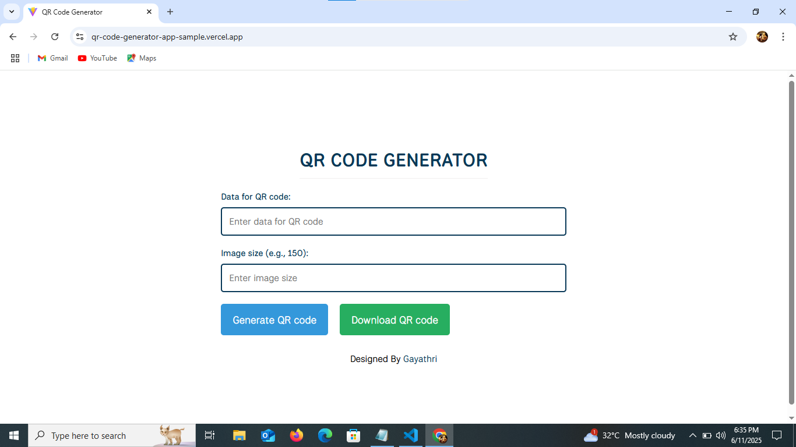
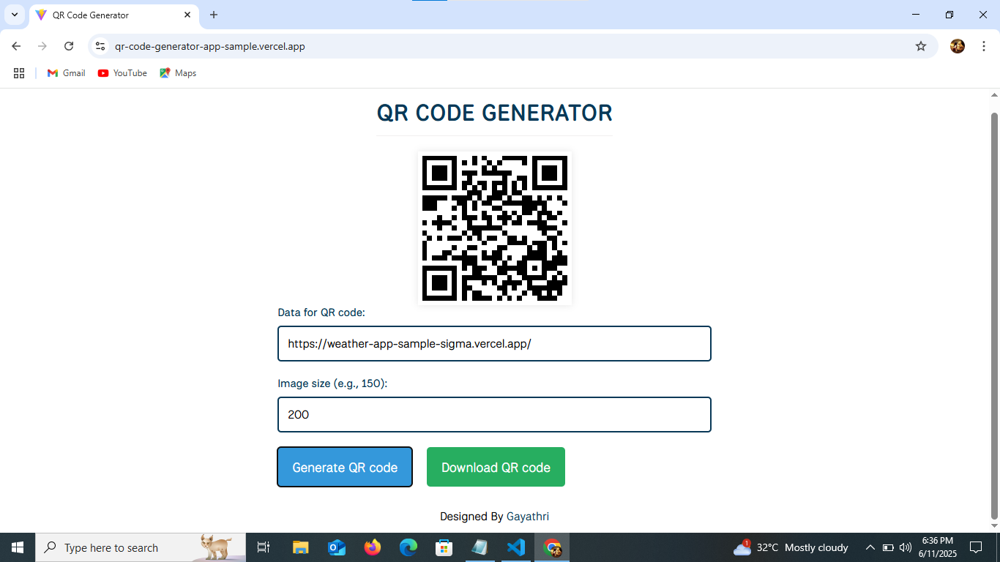
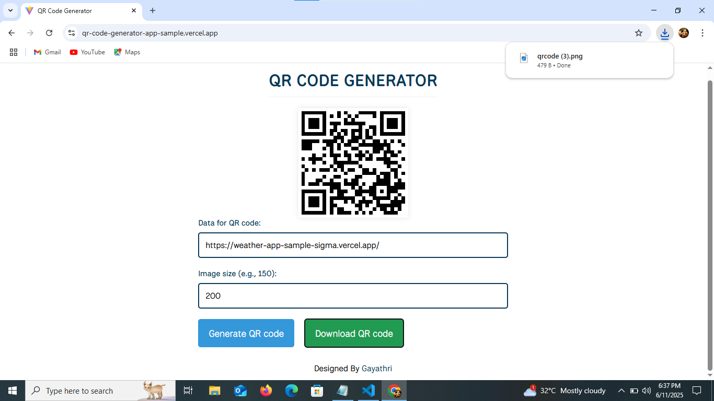

# React QR Code Generator

A simple QR Code Generator built using React that allows users to generate and download QR codes with custom data and size.

## Live Demo

🔗 [Live Demo](https://qr-code-generator-app-sample.vercel.app/)  

## Developed By  
**Gayathri G**  
GitHub: [GAYATHRI1006](https://github.com/GAYATHRI1006)

## Screenshot







## Features

- Generate QR codes instantly based on input text  
- Customize QR code size  
- Download the generated QR code image  
- Responsive and easy-to-use UI  

## Getting Started

### 1. Clone the Repository

```bash
git clone https://github.com/GAYATHRI1006/QR_Code_Generator_App.git
```

### 2. Install Dependencies

```bash
npm install
```

### 3. Run the App

```bash
npm run dev
```

## Tech Stack

- **React**
- **JavaScript**
- **HTML5**
- **CSS3**            
